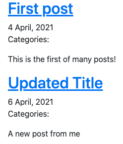
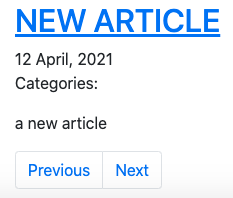
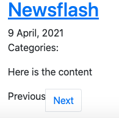
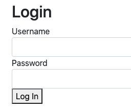
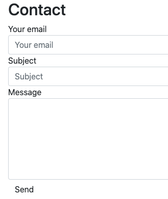
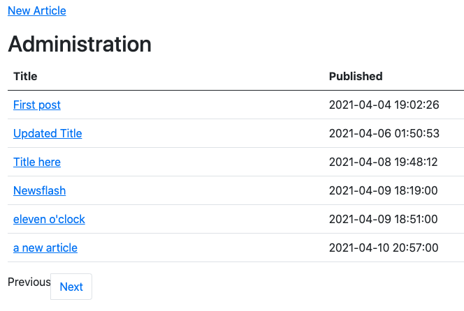
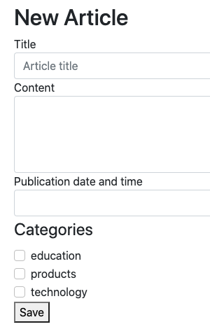
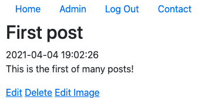

# Clay Pages

This is a template for a basic blog (or news website) that is written in PHP along with JavaScript, MySQL, and scant amounts of HTML and CSS. This project is designed to be a basic blog-style website that can be downloaded and be manipulated in nearly endless ways for different purposes. This site requires XAMPP and the use of Apache Web Server.

## Features:

- Basic title and menu bar that can easily be customized by any user:

- Articles have title, date published, categories, and article content on each blog page:

- Buttons allow user to go through each page of articles, will be greyed out and cannot be clicked if the user reaches the end of the articles:

 

- Login page for administrator to create, publish, delete, and update articles on the blog: 

- A contact form that can be uses PHPMailer to allows visitors to get in touch with the blog administrator via email:

- Admin page where the blog administrator can view articles and add a new page:

- New article page that can be accessed via the admin page, where it can be given a title, time and date published, content, and category (which is accessed from the database):

- By clicking on an individual article, it allows the admin to edit, delete, or add an image to the article in question:

In order to use Clay Pages as is, the XAMPP app needs to be installed and properly configured to start it up. It can be downloaded from [here](https://www.apachefriends.org/download.html). As it is, Clay Pages requires the use of Apache Web Server, MariaDB and (by extension) MySQL. However, Clay Pages can be modified to use other database languages and/or server types. 

Additionally, PHPMailer (version 6.5.0) is included with Clay Pages. The repository for PHPMailer can be found [here](https://github.com/PHPMailer/PHPMailer). Again, another program can be used to enable the mail function instead of PHPMailer. Just like with XAMPP, PHPMailer with have to be configured by the user.